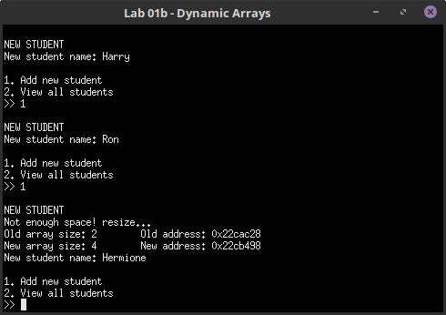

# CS 250 - Lab 1

## Working with Pointers, Memory Management, and Dynamic Arrays

Read this document in Chrome if you want answers to be hidden
as "spoilers" until you choose to open them!

---

## Introduction

It is important to remember and understand the concepts of pointers
as you will be working with them throughout the class.

### Turn-in

Upload your **.cpp**, **.hpp** (or **.h**) files.

Project files are not needed.

### Group Work Policy

* Group work is allowed for this assignment.
* You can also ask questions between each other.
* You are allowed to research on the internet.
* You are allowed to ask the instructor for help.

---

# Program A: Pointers and Classes

## Setup

Make sure to download the base project, "A - Pointers and Classes".

Create a new project and import these files into the project.

### Person.hpp

You won't have to update this file; it contains three classes:
**Person**, an abstract class, **Employee** and **Customer**, which
inherit from Person.

Each of these have a **Display()** method, which will display
information about each object.

### main.cpp

Contains the core functionality using arrays.

* EditEmployee - Allows user to change name of an employee
* EditCustomer - Allows user to change name of a customer
* DisplayEmployee - Displays all employees
* DisplayCustomer - Displays all customers

Notice that for these two pairs of functions have a lot of duplicate
code; we will be updating this to cut down on duplication.

Within **main()**, there is a program loop, where you can edit an
employee, a customer, or view everybody. The list of Employees and
Customers are stored in two static arrays.

## Using Pointers

We're going to update this program to take advantage of pointers.

Since Employee and Customer both inherit from the Person class,
we can essentially treat them as generic "Person" objects instead
of having separate functions for each type.

### EditPerson function

Instead of utilizing EditEmployee and EditCustomer, we can create
a generic function that will have the same code.

You can either make a version with a *reference* to a Person:

	void EditPerson( Person& person )
	{
	}

Or a version that has a *pointer* to a Person:

	void EditPerson( Person* ptrPerson )
	{
	}

The way that the "person"/"ptrPerson" parameter will be accessed will
vary slightly depending on which you do.

The internals of the function will be similar to the existing Display
functions, so you can start with this as a guideline:

    string newName;
    cout << endl;
    cout << "Current name: " << employee.name << endl;
    cout << "New name: ";
    cin >> newName;
    employee.name = newName;
    
But we're going to want to remove "employee" and use our new parameter.

**Using the Reference (Person& person):** Simply swap "employee" with "person".

**Using the Pointer (Person* ptrPerson):** You will swap "employee" with "ptrPerson",
but the pointer needs to be **dereferenced** in order to get to the object's
internal member variables.

	
<strong>
		Method one, dereferencing the pointer THEN getting the name.
	</strong>

	(*ptrPerson).name

	

	
*Keeping the dereference in parenthesis is required.
Order of operations re dereferencing and the dot operator.*

	
<strong>
		Method two, using the "member-of" operator shorthand.
	</strong>

	
	<pre>
	ptrPerson->name
	</pre>

	
	

After you've written the function, down in **main()**, 
change the references to EditCustomer and EditEmployee to both just
call EditPerson.

	
<strong>
		If your parameter is a reference: Then your code will look like this.
	</strong>

	EditPerson( customers[index] );

	
	

	
<strong>
		If your parameter is a pointer: Then you need to pass in the
		*address* of the person, so it will look like this.
	</strong>

	EditPerson( &employees[index] );

	

	
#### Test!

Make sure to build and test the program to make sure it still works properly!

#### Double-check

	
<strong>
		Here is the solution so you can check your work.
	</strong>

	
	// Reference version
	void EditPerson( Person& person )
	{
		string newName;
		cout << endl;
		cout << "Current name: " << person.name << endl;
		cout << "New name: ";
		cin >> newName;
		person.name = newName;
	}

	// Pointer version
	void EditPerson( Person* ptrPerson )
	{
		string newName;
		cout << endl;
		cout << "Current name: " << ptrPerson->name << endl;
		cout << "New name: ";
		cin >> newName;
		ptrPerson->name = newName;
	}

	// main():
	// Reference version
	if ( tolower( choice ) == 'c' )
	{
		EditPerson( customers[index] );
	}
	
	// Pointer version
	if ( tolower( choice ) == 'e' )
	{
		EditPerson( &employees[index] );
	}

### Creating an array of pointers

In **main()**, after

	Employee employees[10];
    Customer customers[10];
    SetupPeople( employees, customers );
    
we will create an array of pointers that will store all the 
Employees and Customers, all lumped in together.

This array will be a static array, it will be of size 20, and
it will store Person pointers.

	
<strong>
		Your declaration will look like this.
	</strong>

	
	Person* people[20];

Then, create a for-loop that iterates from 0 to 10 to populate each
element of the array with the employees and customers.

Remember that because the people array stores pointers, you need
to get the address of each employee/customer as you're storing it
in the array.

1. Set indices 0 - 9 of the *people* array to employees 0 - 9.
2. Set indices 10 - 19 of the *people* array to customers 0 - 9.

	
<strong>
		View solution
	</strong>

	
    for ( int i = 0; i < 10; i++ )
    {
        people[i] = &employees[i];
        people[i+10] = &customers[i];
    }

### Creating a DisplayPeople function

Now we're going to replace the DisplayEmployees and DisplayCustomers
functions with a generic DisplayPeople function.

	void DisplayPeople( Person* people[20] )
	{
	}

Its parameter will be the same array of Person pointers.

Within the function, iterate through each element of the people array,
and call the **Display()** function for each person.

Remember that, since these are pointers we're dealing with, you have 
to either **dereference then use the dot operator** or **use the
address-of operator**.

	
<strong>
		View solution
	</strong>

	
    for ( int i = 0; i < 20; i++ )
    {
        people[i]->Display();
    }

Within **main()**, change out the code for "view all" to
call DisplayPeople, with the *people* array we created earlier.

#### Test!

Make sure to build and test the program to make sure it still works properly!

## Turn in

Zip up your source files (.cpp and .hpp) and label them "Lab1A.zip" and upload this 
project to the Dropbox.

If you worked with someone else, make sure to put their name in the
Dropbox comments.

---

# Program B: Dynamic Arrays

## Setup

Make sure to download the base project, "B - Dynamic Arrays".

Create a new project and import these files into the project,
which we will be filling in.

### StudentList.hpp, StudentList.cpp

These files contains a shell of a student list object.

* Member Methods:
	* StudentList constructor and destructor
	* void AddNewStudent()
	* void ViewAllStudents()
	* bool IsArrayFull() (already implemented)
	* void ResizeArray()
* Member Variables
	* string* m_studentList
	* int m_studentCount
	* int m_arraySize

### main.cpp

The main() function won't need to be updated, and already has the program
logic, which allows the user to add a new student or view the list of students.

## Allocating and Deallocating memory

First, let's work on initializing our dynamic array and allocating its memory,
as well as making sure that memory is deallocated once the
StudentList instance is destroyed.

#### Constructor

Go to the .cpp file and work in the **StudentList()** constructor.
Remember that constructors are called automatically when a new instance 
of the class is created.

You need to do the following:

1. Set the student count (m_studentCount) to 0.
2. Set the array size (m_arraySize) to 2 - the starter size of the array.
3. Initialize the student list array (m_studentList).

Using the m_studentList pointer, create a new array with the new keyword.

	
<strong>
		View solution
	</strong>

	
	StudentList::StudentList()
	{
		m_studentCount = 0;
		m_arraySize = 2;
		m_studentList = new string[ m_arraySize ];
	}

#### Destructor

Go to the **~StudentList()** destructor.
Destructors are called automatically when the instance loses scope and
is destroyed.

At this point, delete the m_studentList array.

	
<strong>
		View solution
	</strong>

	
	StudentList::~StudentList()
	{
		delete [] m_studentList;
	}

## Adding a new student

Right now, the **AddNewStuent()** function only checks to see
if the array is full, and calls the **ResizeArray()** function.

First, we need to add some code to allow a new student to even be
added to the list, and we will work on resizing later.

In this function:

1. Prompt the user to enter a new student name (use cout).
2. Create a temporary string variable called *name*.
3. Store the user's input into *name*.
4. Put the new student name at the end of the m_studentList list (not the end of the array, though).
	1. Remember that you can use m_studentCount to get the next available index.
5. Increment m_studentCount by 1.

	
<strong>
		View solution
	</strong>

	
	void StudentList::AddNewStudent()
	{
		cout << endl << "NEW STUDENT" << endl;
		if ( IsArrayFull() )
		{
			cout << "Not enough space! resize..." << endl;
			cout << "Old array size: " << m_arraySize << "\t Old address: " << m_studentList << endl;
			ResizeArray();
			cout << "New array size: " << m_arraySize << "\t New address: " << m_studentList << endl;
		}

		cout << "New student name: ";
		string name;
		cin >> name;

		m_studentList[m_studentCount] = name;

		m_studentCount++;
	}

## Viewing all students

This method should be relatively simple; iterate through all the
students and display the value of the element.

Note that, since we used a pointer to create an array, you don't 
need to *dereference* the student to display it; treat it like a
normal array.

	
<strong>
		View solution
	</strong>

	
	void StudentList::ViewAllStudents()
	{
		cout << endl << "VIEW ALL STUDENTS" << endl;
		for ( int i = 0; i < m_studentCount; i++ )
		{
			cout << i << ".\t" << m_studentList[i] << endl;
		}
	}

## Resizing the array

Finally, the memory management part of this. We need to:

1. Create a new array of a bigger size.
2. Copy the contents from the small array to the big array.
3. Delete the old small array.
4. Update the m_studentList pointer to point to the new array.

Remember that by the end of the function,
m_arraySize should reflect the size of the bigger array.

The bigger array is just another dynamic array and can be
declared as such.

Use a for-loop to copy over the information from one array to the other.

You can delete the old array by using **delete [] m_studentList**;
Remember that m_studentList is a pointer, and it can be updated
to point to the new, bigger array's memory address.

	
<strong>
		View solution
	</strong>

	
	void StudentList::ResizeArray()
	{
		m_arraySize *= 2;

		// Create a bigger array
		string* newArray = new string[ m_arraySize ];

		// Copy over the information
		for ( int i = 0; i < m_studentCount; i++ )
		{
			newArray[i] = m_studentList[i];
		}

		// Free the old memory
		delete [] m_studentList;

		// Update the pointer
		m_studentList = newArray;
	}

## Test!

Test your program and make sure that it doesn't crash!

Once you're done, zip the source files (.cpp and .hpp), name the zip
"Lab1B.zip", and upload it to the Dropbox.

If you worked with someone else, make sure to put their name in the
Dropbox comments.
