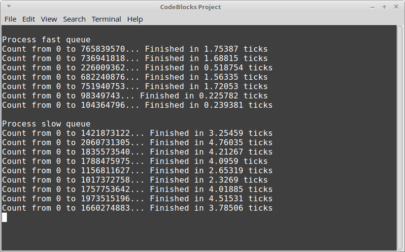

# Queue Lab

## Introduction

For this program, you will replace the std::queue in the project with your
own queue. You will also need to add logic to the function:

	void SplitOutWork( queue<int>& backlog, queue<int>& fastQueue, queue<int>& slowQueue )

in order to distribute the work and process the "fast" tasks first, then the "slow" tasks.

The following source files are included as the starter project:

* main.cpp
* Timer.hpp
* Timer.cpp

## Turn-in

Upload your **.cpp**, **.hpp** (or **.h**) files.

## Group Work Policy

* Group work and/or collaboration is allowed for this assignment.
* You are allowed to research on the internet.
* You are allowed to ask the instructor for help.

---

## Step 1: Implement the SplitOutWork function

Before you swap out the existing queue with your own,
you should implement the SplitOutWork function and test it out.

The backlog of work is passed in, as well as the fast queue and the slow queue.

Go through every item of the backlog, putting items < 10000 into the
fast queue, and the rest in the slow queue.

Run the program to make sure it works.

## Step 2: Add your Queue to the project

Update the project by adding in your DoublyLinkedList and your Queue object.

Replace all references to the std::queue with your own. Note that std's
naming scheme for the queue is:

* push = Enqueue
* pop = Dequeue
* front = Front
