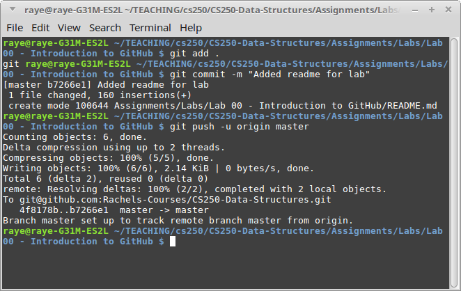

# Lab 00: Introduction to GitHub

(Git-ception!)

## Turn In

In the lab dropbox, you will upload a screenshot of your class repository.
Make sure to put a comment - the URL of your repository.

---

# Intro to GitHub

There is another lab in class tonight, and you will use the code from
that lab to populate your class repository.

This lab is for reference on how to use Git and GitHub.

## 1. Register an account

On [GitHub.com](https://github.com/), register a new account.
It will be a free account. Verify your email address in order to continue.

## 2. Create a repository

Create a repository from your profile page. Your profile page's URL is

	github.com/YOURUSERNAME
	
Then click on the **Repositories** tab, and the **New repository** button.

* Give your repository a name, such as CS 200.
* Add a description if you'd like
* Set repository to public
* Set the .gitignore to C++

A gitignore file lists out common files that you won't want to store in
your repository. These are files like the .exe file that is built
when you compile your project. There's no reason to store this file
in a repository, since it's always changing, and it can be generated
simply by building the project.

Click on **Create repository**.

## 3. Clone the repository locally

On the right-side of your repository's web page, there is a green button
that says **Clone or download**.  Click on it and copy the 
URL out of the textbox. (Make sure it says "Clone with HTTPS".)

Locally on your machine, navigate to a folder that you will store your
repository in. In class, this can be the desktop.
Open Git Bash in this directory.

Type in:

	git clone (YOUR URL)
	
You can usually right-click the window to paste in the URL that you copied.

Hit enter and it will bring down the files - which, at the moment, is an empty folder.

## 4. Add a test file, commit, and push

Create a new text file called **Readme.txt**. Open up this file
and type in:

	CS 200
	Spring 2017
	YOUR NAME
	
Back in Git Bash, make sure it is IN your repository directory. If not, use **cd** to navigate there:

	cd CS-200
	
(If your folder is named "CS-200".)

Then, you will **add** the file, preparing its changes for a changeset:

	git add Readme.txt
	
Note that, while you're typing a file name, you can hit TAB to auto-complete.

Next, you will **commit** all your changes:

	git commit
	
This will pop up notepad for you to add notes about your commit.
Write something like "first commit".

Save and close notepad, and the commit will complete.

Finally, to push your changes to the server, type:

	git push -u origin master
	
It will ask for your username and password for your GitHub account.

Once it's done uploading, refresh the repository web page and look at your changes.

---

# Useful commands

## Adding changes

Every time you update a file, you will have to add it.

	git add (FILENAME)		add one file
	
	git add .			add all files (that aren't in the .gitignore)
	
	git status			check status of items in the repository
	
After you add files, create a changeset by committing:

	git commit				pops up notepad or a text editor for the message
	
	git commit -m "This is my message"
	
And finally, to push your changes to the server, use:

	git push -u origin master
	
## Pulling changes

If you end up working on multiple computers, or working with another person,
you will have to pull the latest changes from the repository **before you push your own changes**.

The order usually goes like this:

1. Decide you're ready to push your changes, but don't do it yet!
2. Add and commit what you've done.
3. Pull any new changes from the repository
4. Git will merge the files
5. Push your changes after the merge.

In command form, it might look like this:

	git add .
	git commit -m "Added new file"
	git pull
	git push -u origin master
	
So, whenever you're ready to pull changes from the repository, use:

	git pull
	

