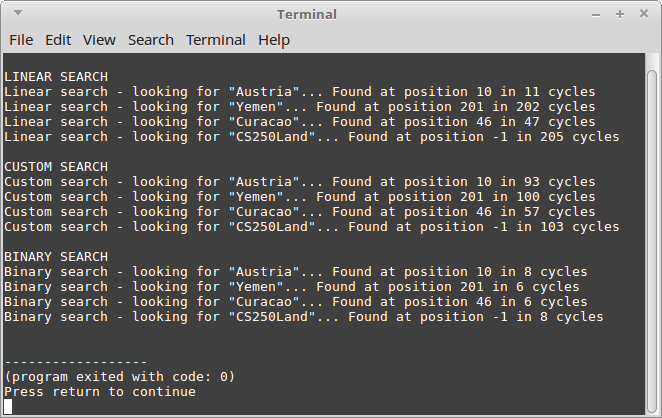

# Searching and efficiency lab (part 2)

## Setup

Make sure to download **countrylist.txt** and **lab2.cpp**. There is some pre-written code,
and you will only need to implement the three search functions.

## Turn-in

Upload your code to your class repository on GitHub,
as well as turning in your code in the class Dropbox.

Make sure to include **all source files: .cpp, .hpp, .h, etc.**. (Project files / solution files are not required.)

## Group Work Policy

* Group work and/or collaboration is allowed for this assignment
* You are allowed to research on the internet
* You are allowed to ask the instructor for help

---

## Reference: Creating a project in Visual Studio

When  you first open Visual Studio, the home screen has the option to create a **New Project**:

Select that.

From the left-hand menu, select **Visual C++**. Note: If you installed Visual Studio community edition on your machine, it may not automatically come with C++ and you'll have to download it.

Select **Empty Project** (make sure you select this one!), and give your project a **Name** and a **Location** on your hard drive. Then click **OK**.

Your project will be created without any files in it, so you will have to create one.

From the **Solution Explorer**, right-click your project, go to **Add**, and select **New Item...**:

(If you accidentally closed Solution Manager, reopen it through View > Solution Explorer)

Select **C++ File (.cpp)** and give it a name, like "Exercise2.cpp", or "YOURNAME.cpp", then click **Add**.

Then you will start off your program with the bare minimum code:

	int main()
	{
		return 0;
	}

And include the following libraries as-needed:

	// For displaying text with cout and getting input with cin.
	#include <iostream>
 
	// For making string variables
	#include <string> 

---

## Making sure your program doesn't immediately end

This is not the best way to make sure your program doesn't quit, but it is OK for now.

Within main, do this:

 	int main()
	{
		while ( true ) { }
		return 0;
	}

This essentially puts an *infinite loop* at the end of your program - but at least it won't quit while you're trying to see it run! :P

You can stop the program in Visual Studio through the square "stop" button.
---

# Searching Algorithms

For these algorithms, you will be using the already-sorted **countrylist.txt** file.

Do not modify main() or the LoadData() functions.

### cycleCounter

In each of the search functions, there is a **cycleCounter** reference parameter.
Every time a cycle of a loop is executed within your search algorithm, you should
make sure to increment this counter by 1.

## Algorithm 1: Linear Search

Implement a simple linear search algorithm, along with the counter
to let you know how many iterations it took.

### Pseudocode

        From i = 0 to size-1, incrementing by 1 each time...:
                Add 1 to the *cycleCounter*.
                Is item at position *i* in the array equal to the *findMe* item?
                        Yes: return this index *i*.
        
        If loop finishes without returning, it means the item was not in the list.
        Return -1 instead.

## Algorithm 2: Custom Search

Implement your own search algorithm to search the list intelligently.
You can do this however you wish, but make it more intelligent than
just a linear search.

Tips:

* Maybe search beginning-to-end, or end-to-beginning, based on if the search item is closer (alphabetically) to the first item or the last item.
* Maybe check the first item and the last item each iteration, closing in towards the middle each cycle. (begin++, end--)
* What other techniques can you think of for searching a sorted list?

## Algorithm 3: Binary Search

Implement the [Binary Search](https://en.wikipedia.org/wiki/Binary_search_algorithm#Algorithm) algorithm.

### Pseudocode

        Create three integer variables: left, right, and mid.
        
        Initialize *left* to 0 and *right* to the size-1.
        
        While left <= right...:
                Increment the *cycleCounter*.
                Set mid equal to the mid-point (left+right)/2.
                
                If the element at position *mid* is equal to *findMe*:
                        return mid.
                
                Otherwise, if the element at position *mid* is less than *findMe*:
                        Set *left* equal to *mid* + 1.
                
                Otherwise, if the element at position *mid* is greater than *findMe*:
                        Set *right* equal to *mid* - 1.
                        
        When the loop is done, if the item hasn't been found, return -1.
