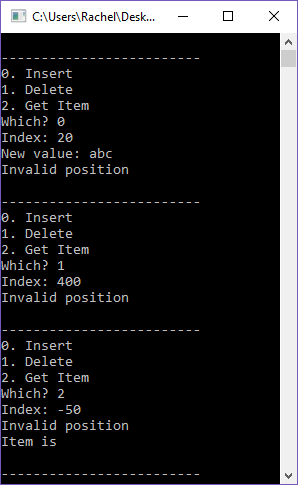

# Exceptions Lab

## Introduction

Read this in Chrome! :)

For this program, two (hypothetical) programmers have worked on a program:

* *Ray* implemented a List object with a static array, but didn't add any
error checking in.
* *Chel* implemented the main program, but also did not put in any error checking.

A user could easily input bad data and cause the program to crash.

Your job is to fix the Linked List to utilize exceptions so that,
even though the usage of the list is haphazard, the program 
will maintain its integrity nonetheless.

## Turn-in

Upload your **.cpp**, **.hpp** (or **.h**) files.

## Group Work Policy

* Group work and/or collaboration is allowed for this assignment.
* You are allowed to research on the internet.
* You are allowed to ask the instructor for help.

## Setup

Download the starting files to work with:

* main.cpp
* List.cpp
* List.hpp

---

# Step 1: Throwing exceptions within the list

Update the functions in the List to throw exceptions on certain conditions. You will be using out_of_range exceptions for each, if the **position** is out of bounds (less than 0 or greater than or equal to m_arraySize).

# Step 2: Catch the errors

Then, within the actual program in main.cpp, you will wrap certain operations with try/catch to make sure any exceptions are caught.

Make sure to wrap your try/catch around the *smallest possible region*.

# Step 3: Test

Test to make sure that you can enter in invalid indices for each operation, and the program does not crash.

