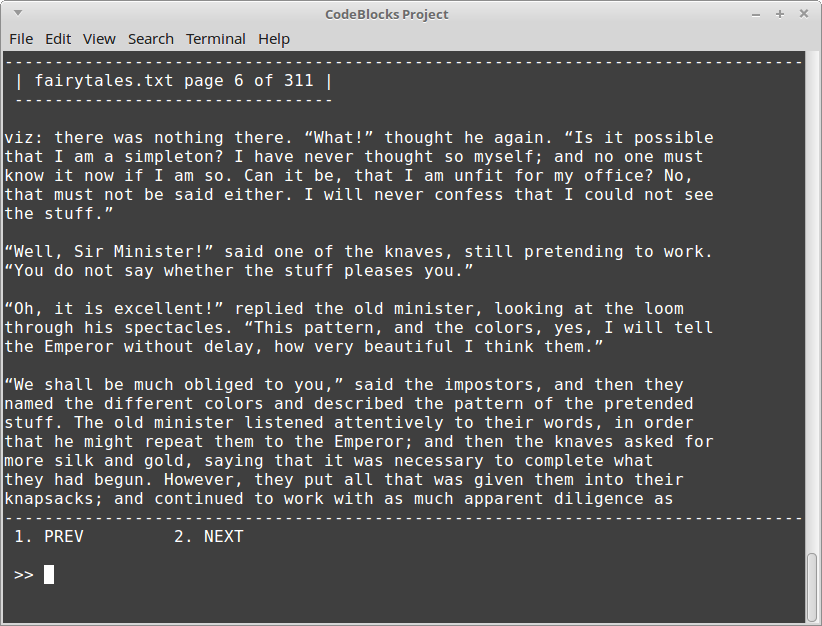

# DoublyLinkedList challenge lab

## Introduction

For this program, you will need to have implemented your DoublyLinkedList
and include it in the project along with the source files:

* BookProgram.hpp
* BookProgram.cpp
* Page.hpp
* main.cpp

(And the source under CPP-Utilities-master)

There is also a file called "fairytales.txt" in the project folder,
which will be read in by the program.

## Turn-in

Upload your **.cpp**, **.hpp** (or **.h**) files.

## Group Work Policy

* Group work and/or collaboration is allowed for this assignment.
* You are allowed to research on the internet.
* You are allowed to ask the instructor for help.

---

If you run the program as-is, it will load the fairytales.txt file and
give you an interface to read and scroll through the text.

At the moment, each **Page** is being stored in a **std::vector** object.

The challenge here is to:

1. Update the BookProgram.hpp so that it stores your **DoublyLinkedList** of Pages, instead of the vector.
2. Update the BookProgram::LoadBook function so that it pushes new pages onto the doubly linked list
3. Update the BookProgram::Run function so that it gets the current page from the doubly linked list, via the page index.

