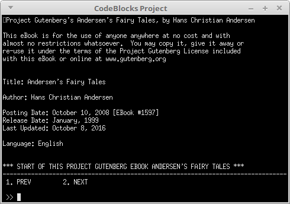

# Linked list project

CS 250, Spring 2017

## Setup

Make sure to download the starter code, which contains the shell for the doubly linked list.

## Turn-in

Upload your code to your class repository on GitHub,
as well as turning in your code in the class Dropbox.

Make sure to include **all source files: .cpp, .hpp, .h, etc.**. (Project files / solution files are not required.)

## Group work policy

* This project is a **solo effort**.
* You can brainstorm with others, but you cannot code together, share code, etc.

---

# Starter project

---

# Linked list specs
