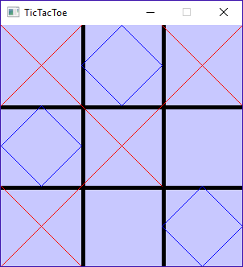

# Project 2: Tic Tac Toe Stacks

## Introduction

For this project, a tic tac toe game has been implemented in C++. You can left-click to place a move, and right-clicking (anywhere) will cause the game to back up by one turn.

This is achieved by storing the state of the grid in a stack every time a move is made.

You will be replacing the STL Stack in the project files with your own stack.

## Turn-In

* Zip up your entire project folder, including the **SDL2-2.0.4** folder, and turn it in via the project Dropbox.

## Group Policy

You can work with another person on this program in teams of 2. However, if you're 
working as a group, you **must** collaborate through source control
and the repository / commit log must be made available to the instructor.

---

# Files Overview

The solution has already been set up to use the [SDL](https://www.libsdl.org/) library to handle drawing basic graphics. Make sure you open the solution file when getting started.

These files are included with the project:

* Files that you won't work with:
	* Application (.hpp, .cpp) - Includes functions for getting SDL set up. 
	* Drawer (.hpp, .cpp) - Includes functions for drawing primitive shapes. 
	* main.cpp - Starts the program.
	* GameBoard.hpp - Contains a 2D char array to represent the game board. 
* Files that you will work with:
	* TicTacToe (.hpp, .cpp) - This class contains a stack of game boards to keep track of history. You will need to update this and a couple other functions (see below).

---

# TicTacToe class

For most of this class, you do not have to make any modifications - all the game logic is already implemented.

However, in the class declaration, a stack of game boards is stored:

	stack<GameBoard> m_gameHistory;

You will eventually be replacing this STL stack with your own Stack object.

Additionally, these two methods handle everything that the game does with the stack:

	void UndoLastMove();
	void PushHistory();

Once your Stack object is implemented, you might have to update these functions (such as, if your push function is named something else.)

---

# Stack Class

You will need to implement a Stack class for this project. The stack
**must be a template**, and must be implemented with a Linked List.
You can *either* use your Stack from the previous lab, where it is 
implemented on top of a DoublyLinkedList, or you can implement
a Stack from scratch.

Your stack needs to have the following public functions that the 
TicTacToe project will access:

* void Push( T data )
* void Pop()
* T Top()
* int GetSize()

## Exception Handling

Your Stack should detect the following errors, and **throw** exceptions
if they are detected.

You will also modify **TicTacToe.cpp** to add try/catch statements
to detect and handle these errors.

### Exception Handling

also be checking for errors and [throwing exceptions](http://www.cplusplus.com/reference/exception/exception/) should they come up:

#### Memory Allocation errors -- bad_alloc

Wrap a try/catch around any **memory allocation**. You should be attempting to catch any [bad_alloc exceptions](http://www.cplusplus.com/reference/new/bad_alloc/).

Example from the cplusplus.com reference page:

	try
	{
		int* myarray= new int[10000];
	}
	catch (std::bad_alloc& ba)
	{
		std::cerr << "bad_alloc caught: " << ba.what() << '\n';
	}

It is unlikely that you will run into this exception while working on your program,
unless you're on a machine with *very very* limited memory.

If you **catch** this error, then you want to perhaps display an error message,
and then throw the same error back up to the next level.

#### Bad indices -- out_of_range

Any time a function is called to get an element, but we end up
pointing to a **nullptr** (such as, we've traversed the list, or the index
given is out of bounds), you will throw another type of exception:  [out_of_range](http://www.cplusplus.com/reference/stdexcept/out_of_range/)

C++ doesn't check for de-referencing nullptrs and it doesn't throw exceptions for it,
so you won't be try/catching anything. You will, however, need to write logic to check
to see if you're going outside the bounds of the list, and if this is the case,
you will *throw* the out_of_range error.

You will want to do checks and throw exceptions for the other Push/Pop/Get functions if the list is empty:
If the first and last nodes are both nullptr, you don't want to dereference those!

---

# Updating the program

Once you've implemented your own Stack object, you will swap out the
usages of the STL Stack from the **TicTacToe.cpp** and **TicTacToe.hpp** files:

## TicTacToe.hpp

Change the 

	stack<GameBoard> m_gameHistory; 

to use your Stack instead.

## TicTacToe.cpp

### Stack update

You will need to update any method calls to the original stack;
the C++ stack has lower-case function names, so if you used upper-case,
you will have to update these.

* TicTacToe constructor - calls push
* PushHistory - calls push and size
* UndoLastMove - calls size, pop, and top.

### Try/Catch update

In *PushHistory* and *UndoLastMove*, you will want to wrap your usage of
the stack in a try/catch.

* PushHistory - This pushes to the end of the DoublyLinkedList, so you
will want to check for out_of_range, in the case that the Stack is empty.
You will also want to check for bad_alloc exceptions, so for this try/catch you
will have 2 catch blocks.

* UndoLastMove - This function should be checking for out_of_range exceptions.

If you catch any exceptions from within the program itself (not the data structures),
then display an error message, including the .what() of the original caught exception
for the bad_alloc exception.

---

# Grading Rubric

<table border="0" cellspacing="0" cellpadding="0" class="ta1"><colgroup><col width="152"/><col width="278"/><col width="167"/><col width="167"/></colgroup><tr class="ro1"><td colspan="4" style="text-align:left;width:98.7pt; " class="ce1">
Grading Rubric
</td></tr><tr class="ro2"><td style="text-align:left;width:98.7pt; " class="ce2">
Name:
</td><td colspan="3" style="text-align:left;width:180pt; " class="ce9"> </td></tr><tr class="ro2"><td style="text-align:left;width:98.7pt; " class="ce2">
Assignment:
</td><td colspan="3" style="text-align:left;width:180pt; " class="ce9">
Tic Tac Toe Stacks
</td></tr><tr class="ro2"><td style="text-align:left;width:98.7pt; " class="ce2">
Class:
</td><td colspan="3" style="text-align:left;width:180pt; " class="ce9">
CS 250, Spring 2017
</td></tr><tr class="ro3"><td style="text-align:left;width:98.7pt; " class="Default"> </td><td style="text-align:left;width:180pt; " class="Default"> </td><td style="text-align:left;width:108pt; " class="Default"> </td><td style="text-align:left;width:108pt; " class="Default"> </td></tr><tr class="ro4"><td colspan="4" style="text-align:left;width:98.7pt; " class="ce3">
Notes
</td></tr><tr class="ro3"><td style="text-align:left;width:98.7pt; " class="Default">
Feedback on your assignment goes here
</td><td style="text-align:left;width:180pt; " class="Default"> </td><td style="text-align:left;width:108pt; " class="Default"> </td><td style="text-align:left;width:108pt; " class="Default"> </td></tr><tr class="ro3"><td style="text-align:left;width:98.7pt; " class="Default"> </td><td style="text-align:left;width:180pt; " class="Default"> </td><td style="text-align:left;width:108pt; " class="Default"> </td><td style="text-align:left;width:108pt; " class="Default"> </td></tr><tr class="ro3"><td style="text-align:left;width:98.7pt; " class="Default"> </td><td style="text-align:left;width:180pt; " class="Default"> </td><td style="text-align:left;width:108pt; " class="Default"> </td><td style="text-align:left;width:108pt; " class="Default"> </td></tr><tr class="ro3"><td style="text-align:left;width:98.7pt; " class="Default"> </td><td style="text-align:left;width:180pt; " class="Default"> </td><td style="text-align:left;width:108pt; " class="Default"> </td><td style="text-align:left;width:108pt; " class="Default"> </td></tr><tr class="ro4"><td colspan="4" style="text-align:left;width:98.7pt; " class="ce3">
Grading Breakdown
</td></tr><tr class="ro3"><td style="text-align:left;width:98.7pt; " class="ce4">
Feature
</td><td style="text-align:left;width:180pt; " class="ce4">
Description
</td><td style="text-align:left;width:108pt; " class="ce4">
Your Score
</td><td style="text-align:left;width:108pt; " class="ce4">
Grade %
</td></tr><tr class="ro3"><td style="text-align:left;width:98.7pt; " class="ce5">
Builds &amp; Runs
</td><td style="text-align:left;width:180pt; " class="ce5"> </td><td style="text-align:left;width:108pt; " class="ce12"> </td><td style="text-align:right; width:108pt; " class="ce12">
30.00%
</td></tr><tr class="ro3"><td style="text-align:left;width:98.7pt; " class="ce6">
Clean Code
</td><td style="text-align:left;width:180pt; " class="ce6"> </td><td style="text-align:left;width:108pt; " class="ce13"> </td><td style="text-align:right; width:108pt; " class="ce13">
5.00%
</td></tr><tr class="ro5"><td style="text-align:left;width:98.7pt; " class="ce5">
Node struct/class
</td><td style="text-align:left;width:180pt; " class="ce5">
Node is implemented properly: ptrNext, ptrPrev, data, and a constructor
</td><td style="text-align:left;width:108pt; " class="ce12"> </td><td style="text-align:right; width:108pt; " class="ce12">
5.00%
</td></tr><tr class="ro5"><td style="text-align:left;width:98.7pt; " class="ce6">
Linked List vars
</td><td style="text-align:left;width:180pt; " class="ce6">
Member variables added – ptrFirst, ptrLast, itemCount
</td><td style="text-align:left;width:108pt; " class="ce13"> </td><td style="text-align:right; width:108pt; " class="ce13">
5.00%
</td></tr><tr class="ro5"><td style="text-align:left;width:98.7pt; " class="ce5">
Linked List / Stack push
</td><td style="text-align:left;width:180pt; " class="ce5">
Logic properly implemented for push function
</td><td style="text-align:left;width:108pt; " class="ce12"> </td><td style="text-align:right; width:108pt; " class="ce12">
10.00%
</td></tr><tr class="ro5"><td style="text-align:left;width:98.7pt; " class="ce6">
Linked List / Stack pop
</td><td style="text-align:left;width:180pt; " class="ce6">
Logic properly implemented for pop function
</td><td style="text-align:left;width:108pt; " class="ce13"> </td><td style="text-align:right; width:108pt; " class="ce13">
10.00%
</td></tr><tr class="ro5"><td style="text-align:left;width:98.7pt; " class="ce5">
Linked List / Stack top
</td><td style="text-align:left;width:180pt; " class="ce5">
Logic properly implemented for top function
</td><td style="text-align:left;width:108pt; " class="ce12"> </td><td style="text-align:right; width:108pt; " class="ce12">
10.00%
</td></tr><tr class="ro5"><td style="text-align:left;width:98.7pt; " class="ce6">
Linked List / Stack – Throw exceptions
</td><td style="text-align:left;width:180pt; " class="ce6">
Proper error checking in the doubly-linked list.
</td><td style="text-align:left;width:108pt; " class="ce13"> </td><td style="text-align:right; width:108pt; " class="ce13">
10.00%
</td></tr><tr class="ro5"><td style="text-align:left;width:98.7pt; " class="ce5">
Main program Stack update
</td><td style="text-align:left;width:180pt; " class="ce5">
Replace usage of STL Stack with your Stack
</td><td style="text-align:left;width:108pt; " class="ce12"> </td><td style="text-align:right; width:108pt; " class="ce12">
5.00%
</td></tr><tr class="ro5"><td style="text-align:left;width:98.7pt; " class="ce6">
Main program Try/Catch
</td><td style="text-align:left;width:180pt; " class="ce6">
Add try/catch error checking into the TicTacToe program
</td><td style="text-align:left;width:108pt; " class="ce13"> </td><td style="text-align:right; width:108pt; " class="ce13">
10.00%
</td></tr><tr class="ro3"><td style="text-align:left;width:98.7pt; " class="ce7"> </td><td style="text-align:left;width:180pt; " class="ce5"> </td><td style="text-align:left;width:108pt; " class="ce12"> </td><td style="text-align:left;width:108pt; " class="ce12"> </td></tr><tr class="ro3"><td style="text-align:left;width:98.7pt; " class="Default"> </td><td style="text-align:left;width:180pt; " class="Default"> </td><td style="text-align:left;width:108pt; " class="ce14"> </td><td style="text-align:left;width:108pt; " class="ce14"> </td></tr><tr class="ro3"><td style="text-align:left;width:98.7pt; " class="ce8">
Totals
</td><td style="text-align:left;width:180pt; " class="ce10"> </td><td style="text-align:right; width:108pt; " class="ce15">
0.00%
</td><td style="text-align:right; width:108pt; " class="ce15">
100.00%
</td></tr></table>
