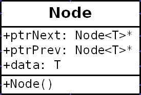
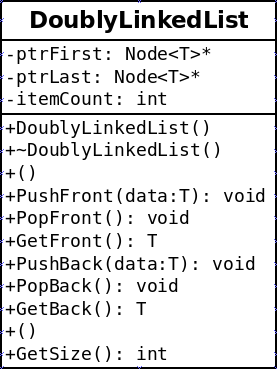
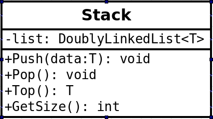

# Project 2: Tic Tac Toe Stacks

## Introduction

For this project, a tic tac toe game has been implemented in C++. You can left-click to place a move, and right-clicking (anywhere) will cause the game to back up by one turn.

This is achieved by storing the state of the grid in a stack every time a move is made.

You will be replacing the STL Stack in the project files with your own stack.

## Turn-In

* Zip up your entire project folder, including the **SDL2-2.0.4** folder, and turn it in via the project Dropbox.

## Group Policy

You can work with another person on this program in teams of 2. However, if you're 
working as a group, you **must** collaborate through source control
and the repository / commit log must be made available to the instructor.

---

# Files Overview

The solution has already been set up to use the [SDL](https://www.libsdl.org/) library to handle drawing basic graphics. Make sure you open the solution file when getting started.

These files are included with the project:

* Files that you won't work with:
	* Application (.hpp, .cpp) - Includes functions for getting SDL set up. 
	* Drawer (.hpp, .cpp) - Includes functions for drawing primitive shapes. 
	* main.cpp - Starts the program.
	* GameBoard.hpp - Contains a 2D char array to represent the game board. 
* Files that you will work with:
	* TicTacToe (.hpp, .cpp) - This class contains a stack of game boards to keep track of history. You will need to update this and a couple other functions (see below).

---

# TicTacToe class

For most of this class, you do not have to make any modifications - all the game logic is already implemented.

However, in the class declaration, a stack of game boards is stored:

	stack<GameBoard> m_gameHistory;

You will eventually be replacing this STL stack with your own Stack object.

Additionally, these two methods handle everything that the game does with the stack:

	void UndoLastMove();
	void PushHistory();

Once your Stack object is implemented, you might have to update these functions (such as, if your push function is named something else.)

---

# DoublyLinkedList Class

Before implementing a Stack, you should implement a generic DoublyLinkedList class. This class should utilize templates and have the standard functions needed for a doubly linked list. Additionally, your LinkedList class should also utilize exceptions and throw exceptions as appropriate.

## Node of a DoublyLinkedList

Note: + is public, top portion is variables, bottom portion is functions.

What makes a DoublyLinkedList "doubly" is that the Node structure/class contains two pointers - one to the next node, and one to the previous node.

### Variables:

* Node<T>* ptrNext
* Node<T>* ptrPrev
* T data

### Functions:

* A constructor should initialize its pointers to **nullptr**.

## DoublyLinkedList

Note: + is public, # is protected, top portion is variables, bottom portion is functions.

The DoublyLinkedList will need to be a generic object, because we will be implementing the **Stack** and, later, the **Queue** with this object. Once it is written once, implementing the Stack will use some of these functions, but not require all of them (though some of these functions will be useful for the Queue or a generic List later on.)

### Member Variables

* ptrFirst
* ptrLast
* itemCount

### Member Methods

Initialization/Deinitialization:

* Constructor
* Destructor

List manipulation:

* PushFront - Add something as the first item of the list
* PopFront - Remove the first item of the list (make the 2nd item the new 1st)
* GetFront - Return the data of the first Node of the list
* PushBack - Add something as the last item of the list
* PopBack - Remove the last item of the list (make 2nd to last the new last)
* GetBack - Return the data at the last Node of the list
* PushItemAt - Push item at a specific index
* PopItemAt - Remove item at a specific index
* GetItemAt - Return the data of a Node at a specific index

Other:

* GetSize - Return the size of the itemCount

### Exception Handling

In addition to implementing the core functionality for a list, you should
also be checking for errors and [throwing exceptions](http://www.cplusplus.com/reference/exception/exception/) should they come up:

#### Memory Allocation errors -- bad_alloc

Wrap a try/catch around any **memory allocation**. You should be attempting to catch any [bad_alloc exceptions](http://www.cplusplus.com/reference/new/bad_alloc/).

Example from the cplusplus.com reference page:

	try
	{
		int* myarray= new int[10000];
	}
	catch (std::bad_alloc& ba)
	{
		std::cerr << "bad_alloc caught: " << ba.what() << '\n';
	}

It is unlikely that you will run into this exception while working on your program,
unless you're on a machine with *very very* limited memory.

If you **catch** this error, then you want to perhaps display an error message,
and then throw the same error back up to the next level.

#### Bad indices -- out_of_range

Any time a function is called to get an element, but we end up
pointing to a **nullptr** (such as, we've traversed the list, or the index
given is out of bounds), you will throw another type of exception:  [out_of_range](http://www.cplusplus.com/reference/stdexcept/out_of_range/)

C++ doesn't check for de-referencing nullptrs and it doesn't throw exceptions for it,
so you won't be try/catching anything. You will, however, need to write logic to check
to see if you're going outside the bounds of the list, and if this is the case,
you will *throw* the out_of_range error.

You will want to do checks and throw exceptions for the other Push/Pop/Get functions if the list is empty:
If the first and last nodes are both nullptr, you don't want to dereference those!

---

# Testing your Linked List

The attached file (and the code in the Tester folder) contain a program
to test the DoublyLinkedList. These files include:

* main.cpp
* ListTester.hpp
* ListTester.cpp

---

# Stack Class

Your Stack class should be built *on top of* your LinkedList class. You will use a "has-a" (compositional) relationship.

The stack will have one private member variable:

* list, a DoublyLinkedList<T>

(This means that the Stack will also be a template class, so the
template type T can "transfer down" to the internal linked list).

Then, the Stack will have the following methods:

* Push - Push some data onto the top of the stack (use PushBack)
* Pop - Remove the top-most node from the stack (use PopBack)
* Top - Get the top-most item from the stack (use GetBack)
* GetSize - Return the value of the list's GetSize function.

The Stack here is essentially just an *interface*; we've done all the hard
work in the DoublyLinkedList, now it's just time to snap on a Stack
or a Queue or a List interface on top.

### Exception Handling

Since the DoublyLinkedList will be throwing errors, the Stack should be
listening for these errors in order to either handle them or pass them on
to the programmer using the Stack class.

For any functions in DoublyLinkedList that could possibly throw an exception,
make sure to wrap the function call in a try/catch. Once caught, throw the same
exception up one step higher (after perhaps an error message).

---

# Testing the Stack

---

# Updating the program

Once you've implemented your own Stack object, you will swap out the
usages of the STL Stack from the **TicTacToe.cpp** and **TicTacToe.hpp** files:

## TicTacToe.hpp

Change the 
	
	stack<GameBoard> m_gameHistory; 

to use your Stack instead.

## TicTacToe.cpp

### Stack update

You will need to update any method calls to the original stack;
the C++ stack has lower-case function names, so if you used upper-case,
you will have to update these.

* TicTacToe constructor - calls push
* PushHistory - calls push and size
* UndoLastMove - calls size, pop, and top.

### Try/Catch update

In *PushHistory* and *UndoLastMove*, you will want to wrap your usage of
the stack in a try/catch.

* PushHistory - This pushes to the end of the DoublyLinkedList, so you
will want to check for out_of_range, in the case that the Stack is empty.
You will also want to check for bad_alloc exceptions, so for this try/catch you
will have 2 catch blocks.

* UndoLastMove - This function should be checking for out_of_range exceptions.

If you catch any exceptions from within the program itself (not the data structures),
then display an error message, including the .what() of the original caught exception
for the bad_alloc exception.

---

# Grading Rubric

<table border="0" cellspacing="0" cellpadding="0" class="ta1"><colgroup><col width="12"/><col width="252"/><col width="256"/><col width="163"/><col width="162"/></colgroup><tr class="ro1"><td style="text-align:left;width:7.71pt; " class="Default"> </td><td colspan="4" style="text-align:left;width:163.64pt; " class="ce1">
Grading Rubric
</td></tr><tr class="ro1"><td style="text-align:left;width:7.71pt; " class="Default"> </td><td style="text-align:left;width:163.64pt; " class="ce2">
Name:
</td><td colspan="3" style="text-align:left;width:165.94pt; " class="ce7"> </td></tr><tr class="ro1"><td style="text-align:left;width:7.71pt; " class="Default"> </td><td style="text-align:left;width:163.64pt; " class="ce2">
Assignment:
</td><td colspan="3" style="text-align:left;width:165.94pt; " class="ce7">
Project 4 (Tic Tac Toe Stack), CS 250
</td></tr><tr class="ro2"><td style="text-align:left;width:7.71pt; " class="Default"> </td><td style="text-align:left;width:163.64pt; " class="Default"> </td><td style="text-align:left;width:165.94pt; " class="Default"> </td><td style="text-align:left;width:105.76pt; " class="Default"> </td><td style="text-align:left;width:104.94pt; " class="Default"> </td></tr><tr class="ro1"><td style="text-align:left;width:7.71pt; " class="Default"> </td><td colspan="4" style="text-align:left;width:163.64pt; " class="ce1">
Breakdown
</td></tr><tr class="ro1"><td style="text-align:left;width:7.71pt; " class="Default"> </td><td style="text-align:left;width:163.64pt; " class="ce3">
Item
</td><td style="text-align:left;width:165.94pt; " class="ce3">
Description
</td><td style="text-align:left;width:105.76pt; " class="ce3">
Total %
</td><td style="text-align:left;width:104.94pt; " class="ce3">
Your Score
</td></tr><tr class="ro1"><td style="text-align:left;width:7.71pt; " class="Default"> </td><td style="text-align:left;width:163.64pt; " class="ce4">
Builds &amp; Runs
</td><td style="text-align:left;width:165.94pt; " class="ce8"> </td><td style="text-align:right; width:105.76pt; " class="ce11">
5.00%
</td><td style="text-align:left;width:104.94pt; " class="ce11"> </td></tr><tr class="ro1"><td style="text-align:left;width:7.71pt; " class="Default"> </td><td style="text-align:left;width:163.64pt; " class="ce5">
Clean Code
</td><td style="text-align:left;width:165.94pt; " class="ce9"> </td><td style="text-align:right; width:105.76pt; " class="ce12">
5.00%
</td><td style="text-align:left;width:104.94pt; " class="ce12"> </td></tr><tr class="ro3"><td style="text-align:left;width:7.71pt; " class="Default"> </td><td style="text-align:left;width:163.64pt; " class="ce4">
Node struct/class
</td><td style="text-align:left;width:165.94pt; " class="ce8">
Node is implemented properly: ptrNext, ptrPrev, data, and a constructor
</td><td style="text-align:right; width:105.76pt; " class="ce11">
5.00%
</td><td style="text-align:left;width:104.94pt; " class="ce11"> </td></tr><tr class="ro4"><td style="text-align:left;width:7.71pt; " class="Default"> </td><td style="text-align:left;width:163.64pt; " class="ce5">
DoublyLinkedList variables
</td><td style="text-align:left;width:165.94pt; " class="ce9">
Member variables added – ptrFirst, ptrLast, itemCount
</td><td style="text-align:right; width:105.76pt; " class="ce12">
5.00%
</td><td style="text-align:left;width:104.94pt; " class="ce12"> </td></tr><tr class="ro4"><td style="text-align:left;width:7.71pt; " class="Default"> </td><td style="text-align:left;width:163.64pt; " class="ce4">
DoublyLinkedList – Push functions
</td><td style="text-align:left;width:165.94pt; " class="ce8">
Logic properly implemented for push functions
</td><td style="text-align:right; width:105.76pt; " class="ce11">
10.00%
</td><td style="text-align:left;width:104.94pt; " class="ce11"> </td></tr><tr class="ro4"><td style="text-align:left;width:7.71pt; " class="Default"> </td><td style="text-align:left;width:163.64pt; " class="ce5">
DoublyLinkedList – Pop functions
</td><td style="text-align:left;width:165.94pt; " class="ce8">
Logic properly implemented for pop functions
</td><td style="text-align:right; width:105.76pt; " class="ce12">
10.00%
</td><td style="text-align:left;width:104.94pt; " class="ce12"> </td></tr><tr class="ro4"><td style="text-align:left;width:7.71pt; " class="Default"> </td><td style="text-align:left;width:163.64pt; " class="ce4">
DoublyLinkedList – Get functions
</td><td style="text-align:left;width:165.94pt; " class="ce8">
Logic properly implemented for get functions
</td><td style="text-align:right; width:105.76pt; " class="ce11">
10.00%
</td><td style="text-align:left;width:104.94pt; " class="ce11"> </td></tr><tr class="ro4"><td style="text-align:left;width:7.71pt; " class="Default"> </td><td style="text-align:left;width:163.64pt; " class="ce5">
DoublyLinkedList – Throw errors
</td><td style="text-align:left;width:165.94pt; " class="ce9">
Proper error checking in the doubly-linked list.
</td><td style="text-align:right; width:105.76pt; " class="ce12">
15.00%
</td><td style="text-align:left;width:104.94pt; " class="ce12"> </td></tr><tr class="ro5"><td style="text-align:left;width:7.71pt; " class="Default"> </td><td style="text-align:left;width:163.64pt; " class="ce4">
Stack interface
</td><td style="text-align:left;width:165.94pt; " class="ce8">
Stack member variable(s) and functions declared properly, delegate tasks to the DoublyLinkedList
</td><td style="text-align:right; width:105.76pt; " class="ce11">
5.00%
</td><td style="text-align:left;width:104.94pt; " class="ce11"> </td></tr><tr class="ro3"><td style="text-align:left;width:7.71pt; " class="Default"> </td><td style="text-align:left;width:163.64pt; " class="ce5">
Stack – Errors
</td><td style="text-align:left;width:165.94pt; " class="ce9">
Stack should catch DoublyLinkedList errors and pass them on.
</td><td style="text-align:right; width:105.76pt; " class="ce12">
5.00%
</td><td style="text-align:left;width:104.94pt; " class="ce12"> </td></tr><tr class="ro4"><td style="text-align:left;width:7.71pt; " class="Default"> </td><td style="text-align:left;width:163.64pt; " class="ce4">
Main program Stack update
</td><td style="text-align:left;width:165.94pt; " class="ce8">
Replace usage of STL Stack with your Stack
</td><td style="text-align:right; width:105.76pt; " class="ce11">
10.00%
</td><td style="text-align:left;width:104.94pt; " class="ce11"> </td></tr><tr class="ro4"><td style="text-align:left;width:7.71pt; " class="Default"> </td><td style="text-align:left;width:163.64pt; " class="ce5">
Main program Try/Catch
</td><td style="text-align:left;width:165.94pt; " class="ce9">
Add try/catch error checking into the TicTacToe program
</td><td style="text-align:right; width:105.76pt; " class="ce12">
15.00%
</td><td style="text-align:left;width:104.94pt; " class="ce12"> </td></tr><tr class="ro1"><td style="text-align:left;width:7.71pt; " class="Default"> </td><td style="text-align:left;width:163.64pt; " class="ce6"> </td><td style="text-align:left;width:165.94pt; " class="ce6"> </td><td style="text-align:left;width:105.76pt; " class="ce13"> </td><td style="text-align:left;width:104.94pt; " class="ce13"> </td></tr><tr class="ro1"><td style="text-align:left;width:7.71pt; " class="Default"> </td><td style="text-align:left;width:163.64pt; " class="ce2">
Totals
</td><td style="text-align:left;width:165.94pt; " class="ce2"> </td><td style="text-align:left;width:105.76pt; " class="ce13"> </td><td style="text-align:left;width:104.94pt; " class="ce13"> </td></tr><tr class="ro1"><td style="text-align:left;width:7.71pt; " class="Default"> </td><td style="text-align:left;width:163.64pt; " class="ce6"> </td><td style="text-align:left;width:165.94pt; " class="ce6"> </td><td style="text-align:right; width:105.76pt; " class="ce13">
100.00%
</td><td style="text-align:right; width:104.94pt; " class="ce14">
0.00%
</td></tr><tr class="ro1"><td style="text-align:left;width:7.71pt; " class="Default"> </td><td style="text-align:left;width:163.64pt; " class="ce6"> </td><td style="text-align:left;width:165.94pt; " class="ce6"> </td><td style="text-align:left;width:105.76pt; " class="ce6"> </td><td style="text-align:left;width:104.94pt; " class="ce6"> </td></tr><tr class="ro2"><td style="text-align:left;width:7.71pt; " class="Default"> </td><td style="text-align:left;width:163.64pt; " class="Default"> </td><td style="text-align:left;width:165.94pt; " class="Default"> </td><td style="text-align:left;width:105.76pt; " class="Default"> </td><td style="text-align:left;width:104.94pt; " class="Default"> </td></tr><tr class="ro2"><td style="text-align:left;width:7.71pt; " class="Default"> </td><td style="text-align:left;width:163.64pt; " class="Default"> </td><td style="text-align:left;width:165.94pt; " class="Default"> </td><td style="text-align:left;width:105.76pt; " class="Default"> </td><td style="text-align:left;width:104.94pt; " class="Default"> </td></tr><tr class="ro2"><td style="text-align:left;width:7.71pt; " class="Default"> </td><td style="text-align:left;width:163.64pt; " class="Default"> </td><td style="text-align:left;width:165.94pt; " class="Default"> </td><td style="text-align:left;width:105.76pt; " class="Default"> </td><td style="text-align:left;width:104.94pt; " class="Default"> </td></tr><tr class="ro2"><td style="text-align:left;width:7.71pt; " class="Default"> </td><td style="text-align:left;width:163.64pt; " class="Default"> </td><td style="text-align:left;width:165.94pt; " class="Default"> </td><td style="text-align:left;width:105.76pt; " class="Default"> </td><td style="text-align:left;width:104.94pt; " class="Default"> </td></tr><tr class="ro2"><td style="text-align:left;width:7.71pt; " class="Default"> </td><td style="text-align:left;width:163.64pt; " class="Default"> </td><td style="text-align:left;width:165.94pt; " class="Default"> </td><td style="text-align:left;width:105.76pt; " class="Default"> </td><td style="text-align:left;width:104.94pt; " class="Default"> </td></tr><tr class="ro2"><td style="text-align:left;width:7.71pt; " class="Default"> </td><td style="text-align:left;width:163.64pt; " class="Default"> </td><td style="text-align:left;width:165.94pt; " class="Default"> </td><td style="text-align:left;width:105.76pt; " class="Default"> </td><td style="text-align:left;width:104.94pt; " class="Default"> </td></tr><tr class="ro1"><td style="text-align:left;width:7.71pt; " class="Default"> </td><td colspan="4" style="text-align:left;width:163.64pt; " class="ce1">
Notes
</td></tr></table>
