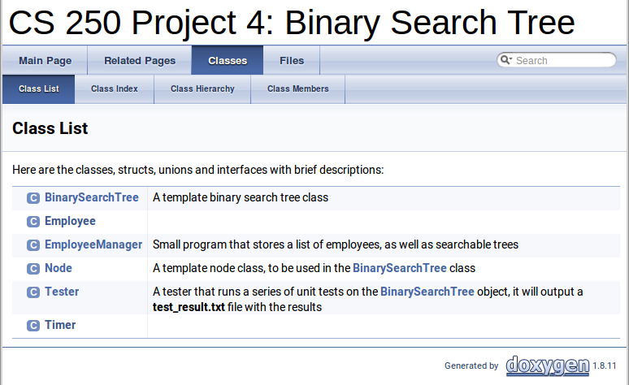
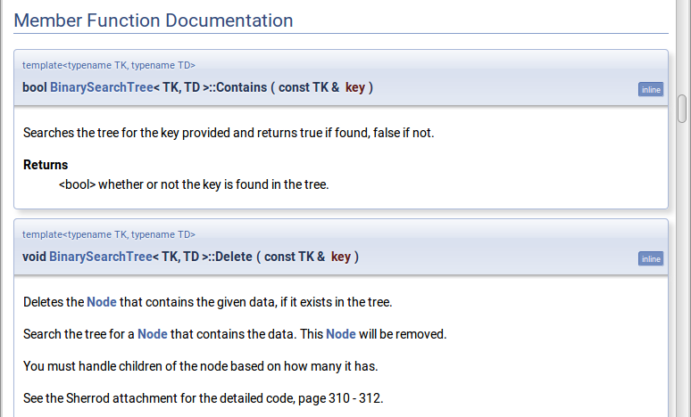
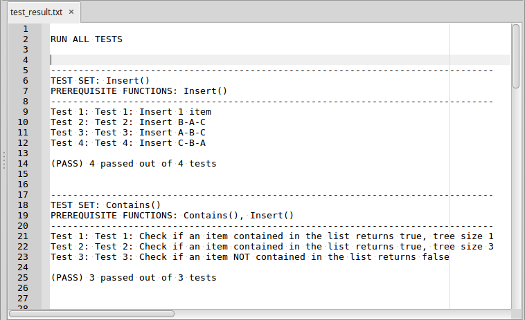

# Project 4: Binary Search Tree

## Introduction

asdfasdfasdf

## Project files

There are two projects included. They have the *BinarySearchTree.hpp* file
in common. One is the tester project and the other is the actual application.

* Tester
	* BinarySearchTree.hpp
	* Tester.hpp
	* test_main.cpp
	
* Program
	* BinarySearchtree.hpp
	* Employee.hpp
	* EmployeeManager.hpp
	* EmployeeManager.cpp
	* Timer.hpp
	* Timer.cpp
	* program_main.cpp

## Turn-In

* Turn in your **StudentTable.cpp** and **StudentTable.hpp** files!

## Group work policy

* This project is a **solo effort**.
* You can brainstorm with others, but you cannot code together, share code, etc.

---

# Doxygen documentation



Descriptions of the functions to implement are given as comments in
the source files, but you can also read these specifications in the
generated doxygen documentation.

Navigate to ```docs/html/index.html```, and from there go to **Classes**
for a list of all the classes.
Descriptions are written for the **BinarySearchTree** object and
simple comments for the **EmployeeManager**.

Some of the code is already implemented, but you will also need
to write some of the functions. See the Allen Sherrod exerpt
(on D2L) for more information about the Binary Search Tree functionality.



<table>
<tr><th> Class </th><th> Function </th><th> Task </th></tr>

<tr><td> BinarySearchTree </td><td> Insert </td><td> Implement me! </td></tr>
<tr><td> BinarySearchTree </td><td> Delete </td><td> Implement me! </td></tr>
<tr><td> BinarySearchTree </td><td> Contains </td><td> Implement me! </td></tr>
<tr><td> BinarySearchTree </td><td> FindNode </td><td> Implement me! </td></tr>
<tr><td> BinarySearchTree </td><td> FindParentOfNode </td><td> Implement me! </td></tr>
<tr><td> BinarySearchTree </td><td> RecursiveInsert </td><td> Implement me! </td></tr>
<tr><td> BinarySearchTree </td><td> GetInOrder </td><td> Implement me! </td></tr>
<tr><td> BinarySearchTree </td><td> GetPreOrder </td><td> Implement me! </td></tr>
<tr><td> BinarySearchTree </td><td> GetPostOrder </td><td> Implement me! </td></tr>

<tr><td> BinarySearchTree </td><td> Constructor </td><td> DONE </td></tr>
<tr><td> BinarySearchTree </td><td> Destructor </td><td> DONE </td></tr>
<tr><td> BinarySearchTree </td><td> GetInOrder </td><td> DONE </td></tr>
<tr><td> BinarySearchTree </td><td> GetPreOrder </td><td> DONE </td></tr>
<tr><td> BinarySearchTree </td><td> GetPostOrder </td><td> DONE </td></tr>
<tr><td> BinarySearchTree </td><td> GetMax </td><td> DONE </td></tr>
<tr><td> BinarySearchTree </td><td> GetCount </td><td> DONE </td></tr>
<tr><td> BinarySearchTree </td><td> GetHeight </td><td> DONE </td></tr>
<tr><td> BinarySearchTree </td><td> GetData </td><td> DONE </td></tr>
</table>

---

# Unit Tests



Unit tests are provided, and you can use the Tester project to
test your BinarySearchTree as you're developing it.

This version of cuTEST doesn't give you a menu to choose tests from,
but instead it runs all of the tests, and exports a *test_result.txt*
file when done.

---

# Grading rubric

<table border="0" cellspacing="0" cellpadding="0" class="ta1"><colgroup><col width="71"/><col width="268"/><col width="74"/><col width="118"/><col width="84"/><col width="181"/><col width="159"/></colgroup><tr class="ro1"><td style="text-align:left;width:45.75pt; " class="ce1"><p>Assignment:</p></td><td style="text-align:left;width:173.91pt; " class="ce1"> </td><td colspan="4" style="text-align:left;width:48.1pt; " class="ce13"><p>CS 250 Project 4: Binary Search Tree / Employee List</p></td><td style="text-align:left;width:102.9pt; " class="ce24"><p>Grading breakdown</p></td></tr><tr class="ro1"><td style="text-align:left;width:45.75pt; " class="ce1"><p>Student name:</p></td><td style="text-align:left;width:173.91pt; " class="ce1"> </td><td colspan="4" style="text-align:left;width:48.1pt; " class="ce13"> </td><td style="text-align:left;width:102.9pt; " class="ce24"><p>Spring 2017</p></td></tr><tr class="ro1"><td style="text-align:left;width:45.75pt; " class="Default"> </td><td style="text-align:left;width:173.91pt; " class="Default"> </td><td style="text-align:left;width:48.1pt; " class="Default"> </td><td style="text-align:left;width:76.39pt; " class="Default"> </td><td style="text-align:left;width:54.79pt; " class="Default"> </td><td style="text-align:left;width:117.3pt; " class="Default"> </td><td style="text-align:left;width:102.9pt; " class="Default"> </td></tr><tr class="ro1"><td colspan="3" style="text-align:left;width:45.75pt; " class="ce2"><p>Grade key (each item out of 5 points)</p></td><td style="text-align:left;width:76.39pt; " class="ce19"> </td><td style="text-align:left;width:54.79pt; " class="ce8"> </td><td style="text-align:left;width:117.3pt; " class="ce8"> </td><td style="text-align:left;width:102.9pt; " class="ce8"> </td></tr><tr class="ro1"><td style="text-align:right; width:45.75pt; " class="ce3"><p>0</p></td><td style="text-align:left;width:173.91pt; " class="ce9"><p>Nothing attempted</p></td><td style="text-align:right; width:48.1pt; " class="ce14"><p>0.00%</p></td><td style="text-align:left;width:76.39pt; " class="ce20"> </td><td style="text-align:left;width:54.79pt; " class="Default"> </td><td style="text-align:left;width:117.3pt; " class="Default"> </td><td style="text-align:left;width:102.9pt; " class="Default"> </td></tr><tr class="ro1"><td style="text-align:right; width:45.75pt; " class="ce3"><p>1</p></td><td style="text-align:left;width:173.91pt; " class="ce9"><p>Something attempted, but wrong</p></td><td style="text-align:right; width:48.1pt; " class="ce14"><p>20.00%</p></td><td style="text-align:left;width:76.39pt; " class="Default"> </td><td style="text-align:left;width:54.79pt; " class="Default"> </td><td style="text-align:left;width:117.3pt; " class="Default"> </td><td style="text-align:left;width:102.9pt; " class="Default"> </td></tr><tr class="ro1"><td style="text-align:right; width:45.75pt; " class="ce3"><p>2</p></td><td style="text-align:left;width:173.91pt; " class="ce9"><p>Incorrect, with a few good items</p></td><td style="text-align:right; width:48.1pt; " class="ce14"><p>40.00%</p></td><td style="text-align:left;width:76.39pt; " class="Default"> </td><td style="text-align:left;width:54.79pt; " class="Default"> </td><td style="text-align:left;width:117.3pt; " class="Default"> </td><td style="text-align:left;width:102.9pt; " class="Default"> </td></tr><tr class="ro1"><td style="text-align:right; width:45.75pt; " class="ce3"><p>3</p></td><td style="text-align:left;width:173.91pt; " class="ce9"><p>Almost correct, a few errors</p></td><td style="text-align:right; width:48.1pt; " class="ce14"><p>60.00%</p></td><td style="text-align:left;width:76.39pt; " class="Default"> </td><td style="text-align:left;width:54.79pt; " class="Default"> </td><td style="text-align:left;width:117.3pt; " class="Default"> </td><td style="text-align:left;width:102.9pt; " class="Default"> </td></tr><tr class="ro1"><td style="text-align:right; width:45.75pt; " class="ce3"><p>4</p></td><td style="text-align:left;width:173.91pt; " class="ce9"><p>Mostly correct, 1 or 2 small errors</p></td><td style="text-align:right; width:48.1pt; " class="ce14"><p>80.00%</p></td><td style="text-align:left;width:76.39pt; " class="Default"> </td><td style="text-align:left;width:54.79pt; " class="Default"> </td><td style="text-align:left;width:117.3pt; " class="Default"> </td><td style="text-align:left;width:102.9pt; " class="Default"> </td></tr><tr class="ro1"><td style="text-align:right; width:45.75pt; " class="ce3"><p>5</p></td><td style="text-align:left;width:173.91pt; " class="ce9"><p>Completely perfect</p></td><td style="text-align:right; width:48.1pt; " class="ce14"><p>100.00%</p></td><td style="text-align:left;width:76.39pt; " class="Default"> </td><td style="text-align:left;width:54.79pt; " class="Default"> </td><td style="text-align:left;width:117.3pt; " class="Default"> </td><td style="text-align:left;width:102.9pt; " class="Default"> </td></tr><tr class="ro1"><td style="text-align:left;width:45.75pt; " class="Default"> </td><td style="text-align:left;width:173.91pt; " class="Default"> </td><td style="text-align:left;width:48.1pt; " class="Default"> </td><td style="text-align:left;width:76.39pt; " class="Default"> </td><td style="text-align:left;width:54.79pt; " class="Default"> </td><td style="text-align:left;width:117.3pt; " class="Default"> </td><td style="text-align:left;width:102.9pt; " class="Default"> </td></tr><tr class="ro1"><td style="text-align:left;width:45.75pt; " class="Default"> </td><td style="text-align:left;width:173.91pt; " class="Default"> </td><td style="text-align:left;width:48.1pt; " class="Default"> </td><td style="text-align:left;width:76.39pt; " class="Default"> </td><td style="text-align:left;width:54.79pt; " class="Default"> </td><td style="text-align:left;width:117.3pt; " class="Default"> </td><td style="text-align:left;width:102.9pt; " class="Default"> </td></tr><tr class="ro1"><td style="text-align:left;width:45.75pt; " class="ce4"><p>Breakdown</p></td><td style="text-align:left;width:173.91pt; " class="ce4"> </td><td style="text-align:left;width:48.1pt; " class="ce4"> </td><td style="text-align:left;width:76.39pt; " class="ce4"> </td><td style="text-align:left;width:54.79pt; " class="ce4"> </td><td style="text-align:left;width:117.3pt; " class="ce4"> </td><td style="text-align:left;width:102.9pt; " class="ce4"> </td></tr><tr class="ro1"><td style="text-align:left;width:45.75pt; " class="Default"> </td><td style="text-align:left;width:173.91pt; " class="ce10"><p>Item</p></td><td style="text-align:left;width:48.1pt; " class="ce15"><p>Score</p></td><td style="text-align:left;width:76.39pt; " class="ce15"><p>Item weight %</p></td><td style="text-align:left;width:54.79pt; " class="ce25"><p>Result</p></td><td style="text-align:left;width:117.3pt; " class="ce10"><p>Notes</p></td><td style="text-align:left;width:102.9pt; " class="ce10"> </td></tr><tr class="ro1"><td style="text-align:left;width:45.75pt; " class="ce5"><p>Basics</p></td><td style="text-align:left;width:173.91pt; " class="ce11"><p>No syntax errors (it builds)</p></td><td style="text-align:right; width:48.1pt; " class="ce16"><p>0</p></td><td style="text-align:right; width:76.39pt; " class="ce21"><p>10.00%</p></td><td style="text-align:right; width:54.79pt; " class="ce26"><p>0.00%</p></td><td style="text-align:left;width:117.3pt; " class="ce11"> </td><td style="text-align:left;width:102.9pt; " class="ce29"> </td></tr><tr class="ro1"><td style="text-align:left;width:45.75pt; " class="ce6"> </td><td style="text-align:left;width:173.91pt; " class="ce11"><p>No logic errors (works as specified)</p></td><td style="text-align:right; width:48.1pt; " class="ce16"><p>0</p></td><td style="text-align:right; width:76.39pt; " class="ce21"><p>4.00%</p></td><td style="text-align:right; width:54.79pt; " class="ce26"><p>0.00%</p></td><td style="text-align:left;width:117.3pt; " class="ce11"> </td><td style="text-align:left;width:102.9pt; " class="ce29"> </td></tr><tr class="ro1"><td style="text-align:left;width:45.75pt; " class="ce6"> </td><td style="text-align:left;width:173.91pt; " class="ce11"><p>No run-time errors (doesn’t crash)</p></td><td style="text-align:right; width:48.1pt; " class="ce16"><p>0</p></td><td style="text-align:right; width:76.39pt; " class="ce21"><p>4.00%</p></td><td style="text-align:right; width:54.79pt; " class="ce26"><p>0.00%</p></td><td style="text-align:left;width:117.3pt; " class="ce11"> </td><td style="text-align:left;width:102.9pt; " class="ce29"> </td></tr><tr class="ro2"><td style="text-align:left;width:45.75pt; " class="ce6"> </td><td style="text-align:left;width:173.91pt; " class="ce11"><p>Clean code - consistent indentation, good variable/function/class names</p></td><td style="text-align:right; width:48.1pt; " class="ce16"><p>0</p></td><td style="text-align:right; width:76.39pt; " class="ce21"><p>2.00%</p></td><td style="text-align:right; width:54.79pt; " class="ce26"><p>0.00%</p></td><td style="text-align:left;width:117.3pt; " class="ce11"> </td><td style="text-align:left;width:102.9pt; " class="ce29"> </td></tr><tr class="ro1"><td style="text-align:left;width:45.75pt; " class="ce6"> </td><td style="text-align:left;width:173.91pt; " class="ce11"><p>No memory errors</p></td><td style="text-align:right; width:48.1pt; " class="ce16"><p>0</p></td><td style="text-align:right; width:76.39pt; " class="ce21"><p>5.00%</p></td><td style="text-align:right; width:54.79pt; " class="ce26"><p>0.00%</p></td><td style="text-align:left;width:117.3pt; " class="ce11"> </td><td style="text-align:left;width:102.9pt; " class="ce29"> </td></tr><tr class="ro1"><td style="text-align:left;width:45.75pt; " class="ce6"> </td><td style="text-align:left;width:173.91pt; " class="ce11"> </td><td style="text-align:left;width:48.1pt; " class="ce16"> </td><td style="text-align:left;width:76.39pt; " class="ce21"> </td><td style="text-align:left;width:54.79pt; " class="ce26"> </td><td style="text-align:left;width:117.3pt; " class="ce11"> </td><td style="text-align:left;width:102.9pt; " class="ce29"> </td></tr><tr class="ro1"><td style="text-align:left;width:45.75pt; " class="ce5"><p>Project</p></td><td style="text-align:left;width:173.91pt; " class="ce11"><p>Insert</p></td><td style="text-align:right; width:48.1pt; " class="ce16"><p>0</p></td><td style="text-align:right; width:76.39pt; " class="ce21"><p>5.00%</p></td><td style="text-align:right; width:54.79pt; " class="ce26"><p>0.00%</p></td><td style="text-align:left;width:117.3pt; " class="ce11"> </td><td style="text-align:left;width:102.9pt; " class="ce29"> </td></tr><tr class="ro1"><td style="text-align:left;width:45.75pt; " class="ce5"><p>specific</p></td><td style="text-align:left;width:173.91pt; " class="ce11"><p>RecursiveInsert</p></td><td style="text-align:right; width:48.1pt; " class="ce16"><p>0</p></td><td style="text-align:right; width:76.39pt; " class="ce21"><p>10.00%</p></td><td style="text-align:right; width:54.79pt; " class="ce26"><p>0.00%</p></td><td style="text-align:left;width:117.3pt; " class="ce11"> </td><td style="text-align:left;width:102.9pt; " class="ce29"> </td></tr><tr class="ro1"><td style="text-align:left;width:45.75pt; " class="ce6"> </td><td style="text-align:left;width:173.91pt; " class="ce11"><p>Delete</p></td><td style="text-align:right; width:48.1pt; " class="ce16"><p>0</p></td><td style="text-align:right; width:76.39pt; " class="ce21"><p>15.00%</p></td><td style="text-align:right; width:54.79pt; " class="ce26"><p>0.00%</p></td><td style="text-align:left;width:117.3pt; " class="ce11"> </td><td style="text-align:left;width:102.9pt; " class="ce29"> </td></tr><tr class="ro1"><td style="text-align:left;width:45.75pt; " class="ce6"> </td><td style="text-align:left;width:173.91pt; " class="ce11"><p>Contains</p></td><td style="text-align:right; width:48.1pt; " class="ce16"><p>0</p></td><td style="text-align:right; width:76.39pt; " class="ce21"><p>10.00%</p></td><td style="text-align:right; width:54.79pt; " class="ce26"><p>0.00%</p></td><td style="text-align:left;width:117.3pt; " class="ce11"> </td><td style="text-align:left;width:102.9pt; " class="ce29"> </td></tr><tr class="ro1"><td style="text-align:left;width:45.75pt; " class="ce6"> </td><td style="text-align:left;width:173.91pt; " class="ce11"><p>FindNode</p></td><td style="text-align:right; width:48.1pt; " class="ce16"><p>0</p></td><td style="text-align:right; width:76.39pt; " class="ce21"><p>5.00%</p></td><td style="text-align:right; width:54.79pt; " class="ce26"><p>0.00%</p></td><td style="text-align:left;width:117.3pt; " class="ce11"> </td><td style="text-align:left;width:102.9pt; " class="ce29"> </td></tr><tr class="ro1"><td style="text-align:left;width:45.75pt; " class="ce6"> </td><td style="text-align:left;width:173.91pt; " class="ce11"><p>FindParentOfNode</p></td><td style="text-align:right; width:48.1pt; " class="ce16"><p>0</p></td><td style="text-align:right; width:76.39pt; " class="ce21"><p>5.00%</p></td><td style="text-align:right; width:54.79pt; " class="ce26"><p>0.00%</p></td><td style="text-align:left;width:117.3pt; " class="ce11"> </td><td style="text-align:left;width:102.9pt; " class="ce29"> </td></tr><tr class="ro1"><td style="text-align:left;width:45.75pt; " class="ce6"> </td><td style="text-align:left;width:173.91pt; " class="ce11"><p>GetInOrder</p></td><td style="text-align:right; width:48.1pt; " class="ce16"><p>0</p></td><td style="text-align:right; width:76.39pt; " class="ce21"><p>5.00%</p></td><td style="text-align:right; width:54.79pt; " class="ce26"><p>0.00%</p></td><td style="text-align:left;width:117.3pt; " class="ce11"> </td><td style="text-align:left;width:102.9pt; " class="ce29"> </td></tr><tr class="ro1"><td style="text-align:left;width:45.75pt; " class="ce6"> </td><td style="text-align:left;width:173.91pt; " class="ce11"><p>GetPreOrder</p></td><td style="text-align:right; width:48.1pt; " class="ce16"><p>0</p></td><td style="text-align:right; width:76.39pt; " class="ce21"><p>5.00%</p></td><td style="text-align:right; width:54.79pt; " class="ce26"><p>0.00%</p></td><td style="text-align:left;width:117.3pt; " class="ce11"> </td><td style="text-align:left;width:102.9pt; " class="ce29"> </td></tr><tr class="ro1"><td style="text-align:left;width:45.75pt; " class="ce6"> </td><td style="text-align:left;width:173.91pt; " class="ce11"><p>GetPostOrder</p></td><td style="text-align:right; width:48.1pt; " class="ce16"><p>0</p></td><td style="text-align:right; width:76.39pt; " class="ce21"><p>5.00%</p></td><td style="text-align:right; width:54.79pt; " class="ce26"><p>0.00%</p></td><td style="text-align:left;width:117.3pt; " class="ce11"> </td><td style="text-align:left;width:102.9pt; " class="ce29"> </td></tr><tr class="ro1"><td style="text-align:left;width:45.75pt; " class="ce6"> </td><td style="text-align:left;width:173.91pt; " class="ce11"><p>GetMax</p></td><td style="text-align:right; width:48.1pt; " class="ce16"><p>0</p></td><td style="text-align:right; width:76.39pt; " class="ce21"><p>5.00%</p></td><td style="text-align:right; width:54.79pt; " class="ce26"><p>0.00%</p></td><td style="text-align:left;width:117.3pt; " class="ce11"> </td><td style="text-align:left;width:102.9pt; " class="ce29"> </td></tr><tr class="ro1"><td style="text-align:left;width:45.75pt; " class="ce6"> </td><td style="text-align:left;width:173.91pt; " class="ce11"><p>GetHeight</p></td><td style="text-align:right; width:48.1pt; " class="ce16"><p>0</p></td><td style="text-align:right; width:76.39pt; " class="ce21"><p>5.00%</p></td><td style="text-align:right; width:54.79pt; " class="ce26"><p>0.00%</p></td><td style="text-align:left;width:117.3pt; " class="ce11"> </td><td style="text-align:left;width:102.9pt; " class="ce29"> </td></tr><tr class="ro1"><td style="text-align:left;width:45.75pt; " class="ce6"> </td><td style="text-align:left;width:173.91pt; " class="ce6"> </td><td style="text-align:left;width:48.1pt; " class="ce17"> </td><td style="text-align:left;width:76.39pt; " class="ce17"> </td><td style="text-align:left;width:54.79pt; " class="ce27"> </td><td style="text-align:left;width:117.3pt; " class="ce6"> </td><td style="text-align:left;width:102.9pt; " class="ce6"> </td></tr><tr class="ro1"><td style="text-align:left;width:45.75pt; " class="ce7"><p>Totals</p></td><td style="text-align:left;width:173.91pt; " class="ce12"> </td><td style="text-align:left;width:48.1pt; " class="ce18"> </td><td style="text-align:right; width:76.39pt; " class="ce22"><p>100.00%</p></td><td colspan="3" style="text-align:right; width:54.79pt; " class="ce28"><p>0.00%</p></td></tr><tr class="ro1"><td style="text-align:left;width:45.75pt; " class="Default"> </td><td style="text-align:left;width:173.91pt; " class="Default"> </td><td style="text-align:left;width:48.1pt; " class="ce3"> </td><td style="text-align:left;width:76.39pt; " class="ce3"> </td><td style="text-align:left;width:54.79pt; " class="ce3"> </td><td style="text-align:left;width:117.3pt; " class="ce3"> </td><td style="text-align:left;width:102.9pt; " class="Default"> </td></tr><tr class="ro1"><td style="text-align:left;width:45.75pt; " class="ce4"><p>Additional notes</p></td><td style="text-align:left;width:173.91pt; " class="ce4"> </td><td style="text-align:left;width:48.1pt; " class="ce4"> </td><td style="text-align:left;width:76.39pt; " class="ce4"> </td><td style="text-align:left;width:54.79pt; " class="ce4"> </td><td style="text-align:left;width:117.3pt; " class="ce4"> </td><td style="text-align:left;width:102.9pt; " class="ce4"> </td></tr></table>
