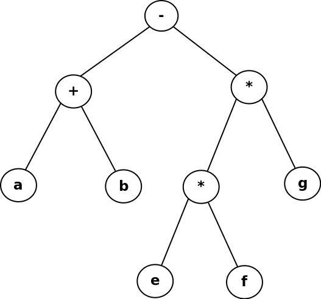
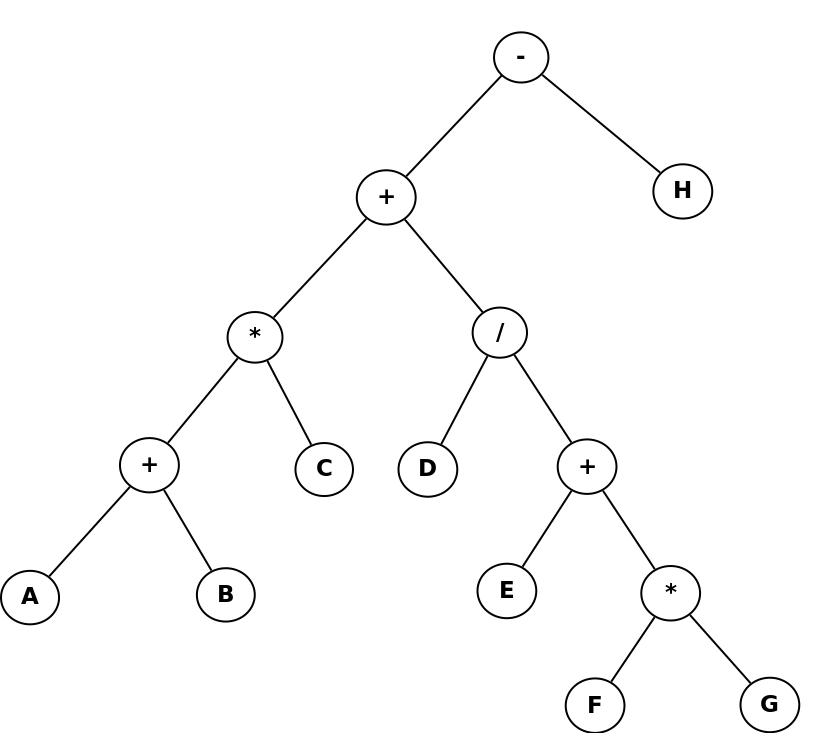

# Lab 10: Binary Expression Tree

## Introduction

For this lab, we will parse a math expression that is given to us in
**postfix form**, and built it into a simple tree structure.

From the tree structure, we will be able to return the expression in **infix** form.

### Example 1

An expression like ```ab+ef*g*-``` (postfix form) will generate a tree that looks like:



and the infix form will be ```a+b-e*f*g```.

### Example 2

An expression like ```AB+C*DEFG*+/+H-``` (postfix form) will generate a tree that looks like:



and the infix form will be ```A+B*C+D/E+F*G-H```.


## Turn-in

Upload your **.cpp**, **.hpp** (or **.h**) files.

## Group Work Policy

* Group work and/or collaboration is allowed for this assignment.
* You are allowed to research on the internet.
* You are allowed to ask the instructor for help.

## Starter files

* Expression.hpp
* Expression.cpp
* main.cpp

---

# Instructions

The function specifications are stored in the **docs/html/** folder.
Select **index.html**, then go to **Classes** and choose **Expression**
to view the Expression documentation. This documentation is also all
in the Expression.cpp file above the functions.


