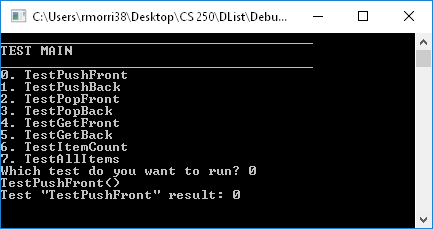

# Class notes, 2016-10-12

---

## Assignments:

* Read Chapters 13 and 14 over Queues and Priority Queues
* Work on Stacks take-home exam (turn this and list take-home exam next week)

---

## Project 4 Introduction: DoublyLinkedList

For Project 4, there are two downloads: LinkedListTester and StarterFiles.

Right now, we're just going to use the Tester files while we're building a doubly linked list,
and the project in StarterFiles will be used later on once  you have a Stack implemented.

Create a project for your DoublyLinkedList.

Download the LinkedListTester and extract the source files into your
project directory.

After adding "ListTester.hpp", "ListTester.cpp", and "main.cpp" to your project, it won't build immediately,
because it's expecting a DoublyLinkedList to exist.

**Create a DoublyLinkedList.hpp file in your project.**

### DoublyLinkedList

Since this list will be a template type, all of the function definitions will go in the .hpp file, as well as the class and function declarations.

Let's start with the node:
	
	#ifndef DOUBLY_LINKED_LIST_HPP
	#define DOUBLY_LINKED_LIST_HPP
	
	template <typename T>
	struct Node
	{
		Node<T>* ptrNext;
		Node<T>* ptrPrev;
		T data;
	
		Node()
		{
			ptrNext = nullptr;
			ptrPrev = nullptr;
		}
	};
	
	#endif

For our doubly-linked list, each node will point to the *next* and *previous* node in the list. This way, we can traverse both forward and backward - but for Stacks and Queues, we will only go one way.

Next, write out the class declaration:

	template <typename T>
	class DoublyLinkedList
	{
	public:
		DoublyLinkedList()
		{
		}
	
		~DoublyLinkedList()
		{
		}
	
		void PushFront(T data)
		{
		}
	
		void PopFront()
		{
		}
	
		T GetFront()
		{
		}
	
		void PushBack(T data)
		{
		}
	
		void PopBack()
		{
		}
	
		T GetBack()
		{
		}
	
		int GetSize()
		{
		}
	
	private:
		Node<T>* ptrFirst;
		Node<T>* ptrLast;
		int itemCount;
	};

Each of the function definitions will go *inside* the class declaration.

You might have to add some dummy return values to get the project to build, but after that you will be able to run the tester and get 0's for everything:

#### DoublyLinkedList Constructor

The constructor of the linked list will need to do the following:

* set itemCount to 0
* set ptrFirst to nullptr
* set ptrLast to nullptr

#### DoublyLinkedList Destructor

The destructor will need to clear out all the elements from the list, until the list is empty.

You can do this by utilizing one of the Pop functions, after they have been implemented, until the itemCount is 0.

#### PushFront

For PushFront:

1. Create a new Node object.
2. Initialize the new Node object's data

This will be common to both PushFront and PushBack, at least:

	Node<T>* newNode = new Node<T>();
	newNode->data = data;

Then, we have to figure out whether this is the first item of the list or not, because there will be two different ways to add it.

	if (ptrFirst == nullptr)
	{
		// First item in list
	}
	else
	{

	}

If it is the first item, simply set ptrFirst and ptrLast to point to this new node.

If it is **not** the first item, then this new node is the new **FRONT** of the list. This means...

* The current first node will become the 2nd node.
* The current first node will need to point backwards to the new node.
* The new node will need to point forward to the current first node.
* The ptrFirst pointer will need to be updated to point at the new node.

Afterwards, either way, you will want to increment itemCount by one.

Here is the code:

	void PushFront(T data)
	{
		Node<T>* newNode = new Node<T>();
		newNode->data = data;

		if (ptrFirst == nullptr)
		{
			// First item in list
		}
		else
		{
			newNode->ptrNext = ptrFirst;
			ptrFirst->ptrPrev = newNode;
			ptrFirst = newNode;
		}
	}

#### PopFront

For PopFront, you will need to check for a few cases...

1. If the list is empty - well, you might want to throw an exception!
2. If the list only has one item, we will delete the item, but also remember to set the ptrFirst and ptrLast pointers to nullptr.
3. Otherwise, delete the front-most node and update ptrFirst.

For the third case (more than 1 item in the list), you will do the following:

* Update the ptrFirst pointer to point at the 2nd item in the list.
* Delete the old-first-pointer (you can still access it through ptrFirst->ptrPrev).
* Set the ptrFirst pointer's previous item to nullptr.
* Decrease the item count.

Here is the code:

	void PopFront()
	{
		if (itemCount == 0)
		{
			return;
		}

		if (itemCount == 1)
		{
			delete ptrFirst;
			ptrFirst = nullptr;
			ptrLast = nullptr;
			itemCount--;
		}
		else
		{
			ptrFirst = ptrFirst->ptrNext;
			delete ptrFirst->ptrPrev;
			ptrFirst->ptrPrev = nullptr;
			itemCount--;
		}
	}

#### GetFront

This function will simply get the data stored in the ptrFirst pointer and return that.

	T GetFront()
	{
		return ptrFirst->data;
	}

#### Others...

Try to implement PushBack, PopBack, and GetBack on your own. It will be similar to the Front functions, but working with the end of the list instead of the beginning of the list.

---

# Next Steps...

1. Once you have the functions implemented, try to test it out through the tester.
2. You will need to add in exception handling - this is just the basic functionality of the doubly linked list.
3. You will need to create a Stack class that contains the doubly linked list, and implement the standard Stack functions through this.

